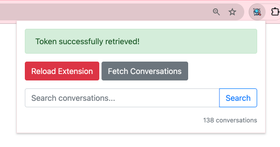
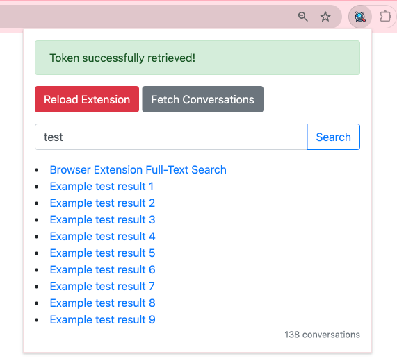

# AI Chat Search Chrome Extension

aka ChatGPT Search, OpenAI Search, ChatGTP Search Extension, Chrome ChatGTP Search Extension.

## Introduction

AI Chat Search is a Chrome Extension allows you to search through all your OpenAI ChatGPT conversations.

It searches:

- titles
- all converstations texts (questions & answers)

It tool utilizes full-text search techniques to allow users to quickly find and navigate through their conversations stored in Chrome's IndexedDB.

## Features

- Search through saved conversations using keywords.
- All data stored on your machine:
  Integration with Chrome's IndexedDB for storing and retrieving chat data.
- Fetch and display the number of stored conversations.
- Trigger searches directly from the popup with the Enter key or using a search button.

## Installation Instructions

### Prerequisites

Google Chrome

### Installation Steps

1. Download or clone the repository to your local machine.
2. Open Google Chrome.
3. Navigate to `chrome://extensions/` in your Chrome browser.
4. Enable Developer mode by toggling the switch at the top-right corner.
5. Click on the "Load unpacked" button.
6. Navigate to and select the directory where your extension's files are located.
7. The AI Chat Search extension should now be installed and appear in your list of extensions.

## Contributing

Contributions to AI Chat Search are welcome!

### Submitting Changes

- Fork the repository.
- Create a new branch for your changes.
- Make your changes and test them.
- Submit a pull request against the main branch.
- Include a clear description of the changes and any relevant issue numbers.
